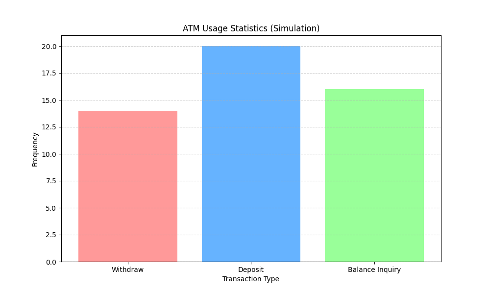

# Password Protected ATM System (8051 Assembly)



## Overview
This repository contains a professional implementation of a **Password Protected ATM System** using 8051 Assembly language (targeted for the 89C51 microcontroller). It also includes a Python-based simulation suite for logic verification and data visualization.

### Key Features
- **Secure Authentication**: PIN-based access control (Default PIN: `1234`).
- **ATM Operations**: 
  - Withdrawal Simulation
  - Deposit Simulation
  - Balance Inquiry
- **Hardware Integration**: Designed for 16x2 LCD display and 4x3 Matrix Keypad.
- **Verification Suite**: Includes a Python simulator and unit tests for the core logic.
- **Analytics**: Automated plotting of transaction distribution.

---

## Project Structure
```text
Password-protected-ATM/
├── src/                # Assembly Source Code
│   └── atm_system.asm  # Main 8051 logic
├── tests/              # Testing & Simulation
│   ├── simulator.py    # Python logic simulator & Plot generator
│   └── test_atm.py     # Unit tests for the ATM logic
├── assets/             # Generated plots and images
├── docs/               # Documentation materials
└── README.md           # Project documentation
```

---

## Getting Started

### 1. Hardware Assembly
The Assembly code is written for the 89C51 microcontroller. 
- **Port 0**: LCD Data Lines
- **Port 1**: Control Lines (RS, EN) and Function Buttons (P1.0-P1.2)
- **Port 2**: Keypad Rows/Columns

### 2. Running Simulations (Python)
To verify the logic without hardware, you can run the Python simulator:
```bash
# Install dependencies
pip install matplotlib pytest

# Run the simulation and generate plots
python tests/simulator.py

# Run unit tests
pytest tests/test_atm.py
```

### 3. Assembly Compilation
Use any 8051 assembler (e.g., Keil uVision, ASEM-51, or SDCC) to compile `src/atm_system.asm` into a HEX file for flashing.

---

## Simulation Plots
The `simulator.py` script generates usage statistics to help visualize how the ATM is being used in a batch environment. The chart shows the frequency of different operations (Withdrawal, Deposit, Balance Check).

---

## License
MIT License