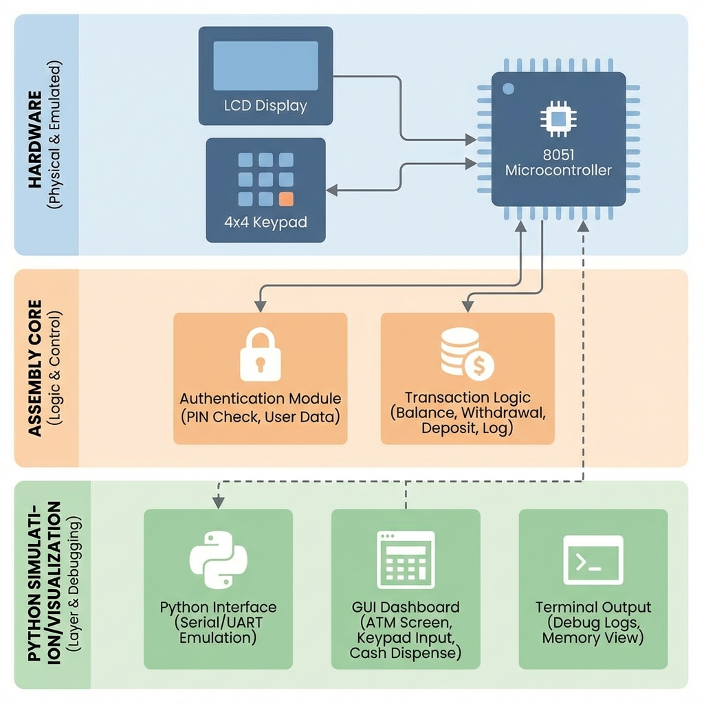

# System Architecture

## Overview

The ATM system consists of three main layers:

1.  **Hardware Layer**: The physical interface (simulated or real) comprising the 89C51 microcontroller, 4x3 Matrix Keypad, and 16x2 LCD Display.
2.  **Assembly Core**: The logic layer written in 8051 assembly, handling authentication, I/O scanning, and transaction logic.
3.  **Simulation Layer**: A Python-based suite that facilitates testing and visualizes logic states without physical hardware.

## Diagram

## Component Description

### 8051 Microcontroller
The heart of the system. It manages the state machine:
-   **Idle**: Waiting for user input.
-   **Auth**: Validating PIN against stored hash/value.
-   **Menu**: Processing user selection (Withdraw, Deposit, Balance).

### Peripherals
-   **LCD (Port 0 + Port 1)**: Displays prompts and feedback.
-   **Keypad (Port 2)**: Accepts user PIN and menu choices.
